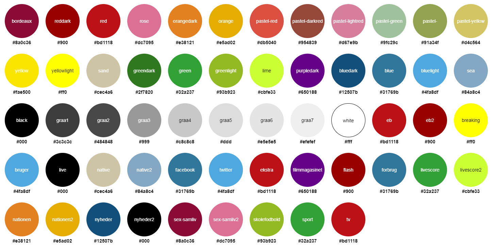

# EB Colors

Version: 1.1.5

> EB colors for SCSS and CSS

## Installation

```bash
npm install "@ekstra-bladet/eb-colors" --save
```

## CSS Usage

### All CSS classes

```css
@import "node_modules/@ekstra-bladet/eb-colors/dist/eb-colors-classes.css";
```

### HEX CSS variables

```css
@import "node_modules/@ekstra-bladet/eb-colors/dist/eb-colors-css-vars.css";

.use-hex-color {
  background: var(--eb-color--red);
}
```

### RGB CSS variables

```css
@import "node_modules/@ekstra-bladet/eb-colors/dist/eb-colors-vars-rgb.css";

.use-rgb-color {
  background: rgb(var(--rgb-color--red));
}
```

## SCSS Usage

Variables and maps:

```scss
@import "node_modules/@ekstra-bladet/eb-colors/src/all.scss";
```

Variables, maps and classes:

```scss
@import "node_modules/@ekstra-bladet/eb-colors/src/all-with-classes.scss";
```

General colors:

```scss
@import "node_modules/@ekstra-bladet/eb-colors/src/general/all[-with-classes].scss";
```

All Section specific colors:

```scss
@import "node_modules/@ekstra-bladet/eb-colors/src/sections/all[-with-classes].scss";
```

### All colors

Found in [src/colors](src/colors)

Full map of all colors `$eb-colors-colors`

| File names            | Map names                |
| ---                   | ---                      |
| _blue.scss            | $eb-color-blue           |
| _green.scss           | $eb-color-green          |
| _greyscale.scss       | $eb-color-greyscale      |
| _orange.scss          | $eb-color-orange         |
| _pastel.scss          | $eb-color-pastel         |
| _red.scss             | $eb-color-red            |
| _yellow.scss          | $eb-color-yellow         |

### Main colors

Found in [src/general](src/general)

Full map of general colors `$eb-colors-general`

| File names            | Map names                |
| ---                   | ---                      |
| _main.scss            | $eb-color-main           |
| _socialmedia.scss     | $eb-color-socialmedia    |

### Section specific colors

Found in [src/sections](src/sections)

Full map of section colors `$eb-colors-sections`

| File names            | Map names                 |
| ---                   | ---                       |
| _ekstra.scss          | $eb-color-ekstra          |
| _filmmagasinet.scss   | $eb-color-filmmagasinet   |
| _flash.scss           | $eb-color-flash           |
| _forbrug.scss         | $eb-color-forbrug         |
| _livescore.scss       | $eb-color-livescore       |
| _nationen.scss        | $eb-color-nationen        |
| _nyheder.scss         | $eb-color-nyheder         |
| _sex-samliv.scss      | $eb-color-sex-samliv      |
| _skolefodbold.scss    | $eb-color-skolefodbold    |
| _sport.scss           | $eb-color-sport           |
| _tv.scss              | $eb-color-tv              |

### Color functions

The following functions are include when using one of the three collection options (all, general or sections).

Without the included functions the colors can be accessed through [map-deep-get](https://css-tricks.com/snippets/sass/deep-getset-maps/#article-header-id-0)

#### Example map structure

```scss
$eb-colors: (
  '[colorname]': map-get($eb-colors-colors, 'key'),
);
```

### Background (background-color: & color:)

Sets both background-color and color, to ensure correct usage

```scss
@import "node_modules/@ekstra-bladet/eb-colors/src/all";

.selector {
  @include .eb-bg--[colorname];
}
```

### foreground (color:)

Returns the main color

```scss
@import "node_modules/@ekstra-bladet/eb-colors/src/all";

.selector {
  color: var(--eb-color--[colorname]);
}
```

### Mapping colors

Each of general colors `$eb-colors-general` (found in [src/general](src/general)) & section colors `$eb-colors-sections` (found in [src/sections](src/sections)) are mapped from all colors `$eb-colors-colors`

```scss
$eb-color-[new-map-name]: (
  'sport' : map-get($eb-colors-colors, 'key'),
)
```

### CSS classes

CSS classes are generated after the following pattern

```css
.eb-bg--[sectionname] {
    background-color: [main section color];
    color: [foreground section color];
}

.eb-color--[sectionname] {
    color: [main section color];
}

/** Real world example */
.eb-bg--eb {
    background-color: var(--eb-color--eb);
    color: var(--eb-fgcolor--eb);
}

.eb-color--eb {
    color: var(--eb-color--eb);
}
```

Working example

```html
<div class="eb-bg--eb">
    This will have the eb background color and the corresponding foreground color.
</div>
```

## Color pallette

The colors and their names contained in eb-colors



## Development

To build the CSS variables version of eb-colors:

```bash
npm build
```

## License

Apache-2 © Ekstra Bladet
